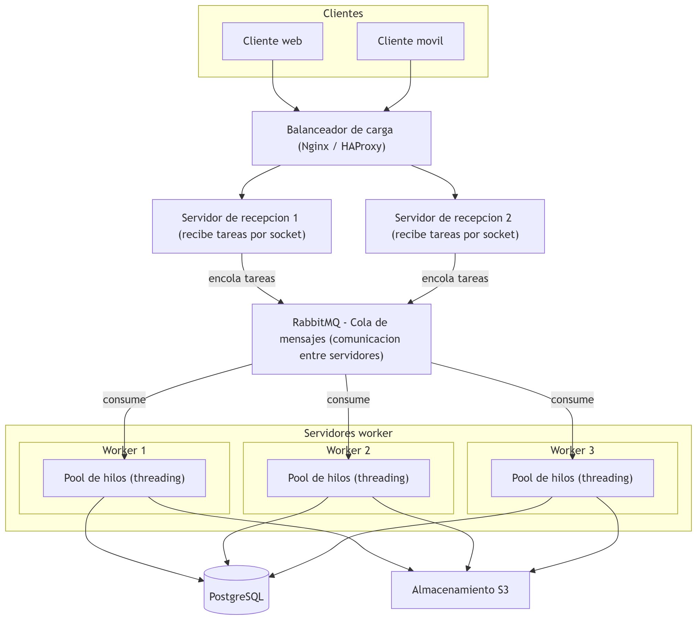

# Sistema Distribuido Cliente-Servidor con Sockets y Pool de Hilos

### 1. Iniciar el Servidor
Abrir una terminal en la carpeta del proyecto y ejecutar:
python servidor.py

El servidor levanta el pool de workers y queda escuchando en el puerto 5000.

### 2. Iniciar el Cliente
Abrir una segunda terminal y ejecutar:
python cliente.py

El cliente envia la lista de tareas y muestra el resultado de cada una,
indicando que worker la proceso.

### 3. Probar la distribucion entre workers
1. Abrir una o mas terminales adicionales con: python cliente.py
2. Observar en la consola del servidor como las tareas de los distintos
   clientes se reparten entre los mismos workers de forma concurrente.

## Diagrama del Sistema

